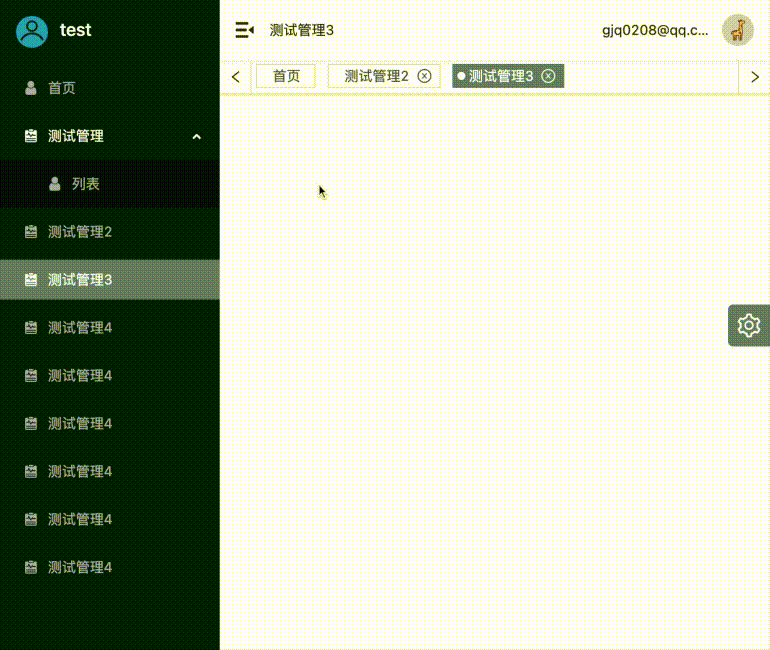

# react-antd-admin

基于react+ts+antd构建的管理后台脚手架模版


线上地址[ http://g_guojq.gitee.io/react-antd-admin]( http://g_guojq.gitee.io/react-antd-admin)

git地址 https://github.com/guo-jianqiang/react-antd-admin

## 1.ConfigurationDrawer

### 1-1.可缓存系统配置

记录用户使用的系统配置，缓存浏览器中，记录用户习惯。目前可支持菜单展开收起状态和换肤

### 1-2.antd换肤


使用[antd-theme-webpack-plugin](https://github.com/mzohaibqc/antd-theme-webpack-plugin)插件实现导出antd样式文件并绑定cssVariable，通过less.js 浏览器在线编译改变less variable 方法实现主题样式变更

```less
@import "_var";

:root{
	--primary-color: @primary-color;
	--danger-color: red;
}
```


```ts
window.less.modifyVars(vars).then(() => {
    if (vars['@primary-color'] === getItem(SYSTEM_CONFIG).primaryColor) return
    message.success('主题色切换成功')
  })
  window.less.refreshStyles()
```


## 2.Tab

### 2-1.支持可缓存路由



配置只需在routeItems文件中配置参数即可，如下

```tsx
export interface RouteItem {
  path: string
  exact: boolean
  meta: {
    tabFixed?: boolean // 是否固定tab项
    isCache?: boolean // 是否路由缓存
    name: string
    icon: Function | string
    hidden?: boolean // 是否隐藏菜单
  }
  component: ComponentType
  routes?: Array<RouteItem>
}
```

### 2-2.支持清除路由缓存

Layout组件中传入缓存控制函数，更多信息请查看[react-router-cache-route](https://github.com/CJY0208/react-router-cache-route)

```tsx
export interface aliveControlInterface {
  dropByCacheKey: (cacheKey: string) => void  // 清除缓存，仅当前页面路由和清除缓存路由不显示时可使用
  refreshByCacheKey: (cacheKey: string) => void // 刷新当前路由
  getCachingKeys: () => Array<string> // 或者缓存路由key列表
  clearCache: () => void // 清除所有缓存
}
```

## 环境配置

使用[cross-env](https://github.com/kentcdodds/cross-env)设置环境变量，从而实现不同环境下的可配置化，配置获取来源为根目录下的env文件夹中获取(development.json、test.json、producation.json)

案例如下：

```json
// development.json 同其他文件
{
  "SERVER_URL": "www.baidu.com"
}
```


```json
"scripts": {
    "dev": "cross-env NODE_ENV=development webpack serve --config webpack/webpack.dev.ts",
    "test": "cross-env NODE_ENV=test webpack serve --config webpack/webpack.dev.ts",
    "build": "cross-env NODE_ENV=production webpack --config webpack/webpack.prod.ts"
  },

```

```json
plugins: [
    new webpack.DefinePlugin({
      "process.env.APP_CONFIG": JSON.stringify(envConfig)
    })
    ....
  ]
```

## 初始化

```shell
yarn install
or
npm install
```
## 运行
```shell
npm run dev
```
[http://localhost:8000/](http://localhost:8000/)

## 打包
```shell
npm run build
```